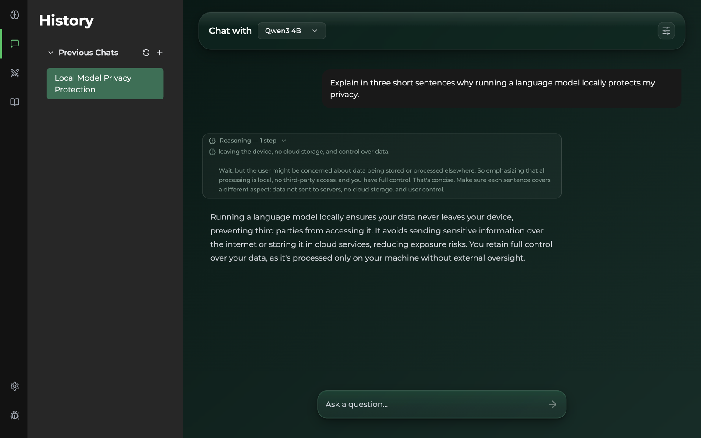
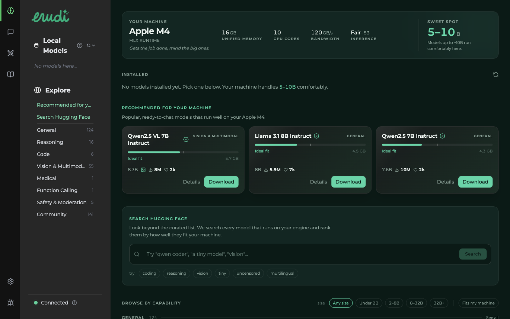
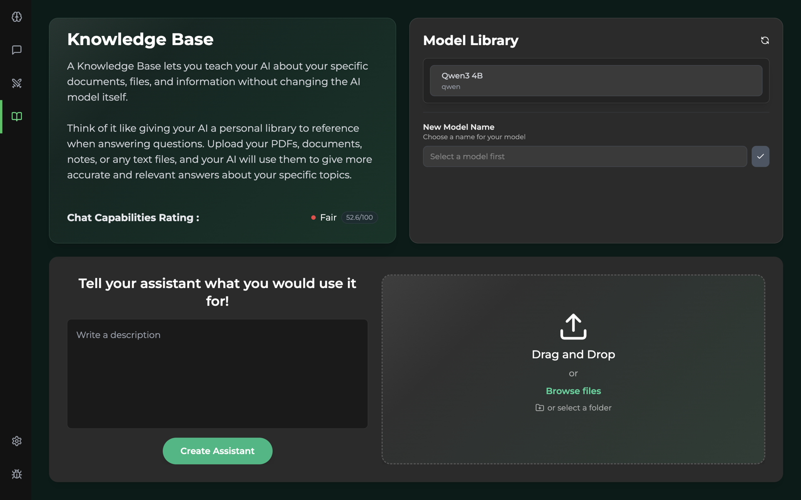

# Erudi

**Run local AI models on your machine — no cloud, no subscription, no data leaving your device.**

[](https://github.com/erudi-app/erudi/releases)
[](https://github.com/erudi-app/erudi/actions/workflows/backend-ci.yml)
[](https://github.com/erudi-app/erudi/actions/workflows/app-build-smoke.yml)
[](LICENSE)
[](https://erudi-app.github.io/erudi/)

Erudi is a desktop application that lets you download, run, and chat with open-source language models entirely offline. It automatically detects your hardware and routes inference to the best available backend: NVIDIA GPU (CUDA), Apple Silicon (MLX), or CPU.



**[Download the latest release](https://github.com/erudi-app/erudi/releases)** — signed installers for macOS (Apple Silicon), Windows (CPU and NVIDIA CUDA) and Linux. Open it, pick a model that fits your machine, start chatting.

<table>
  <tr>
    <td width="50%"></td>
    <td width="50%"></td>
  </tr>
  <tr>
    <td align="center"><sub>Catalog ranked for your hardware</sub></td>
    <td align="center"><sub>Knowledge base: documents in, grounded answers out</sub></td>
  </tr>
</table>

---

## Features

- **Local inference** — models run on your hardware via [llama.cpp](https://github.com/ggerganov/llama.cpp) on Windows and Linux, and [MLX](https://github.com/ml-explore/mlx) on Apple Silicon
- **Automatic hardware detection** — picks CUDA, MLX, or CPU at startup
- **Model library** — browse a catalog of ready-to-run models, each card showing whether it fits your machine, and download it in one click. Erudi downloads pre-built MLX and GGUF artifacts; it never converts or quantizes weights locally
- **Knowledge Base** — attach documents (`.pdf`, `.docx`, `.xlsx`, `.csv`, `.txt`, `.md`) to a model for RAG (retrieval-augmented generation), with hybrid dense + keyword retrieval
- **Conversations kept on your machine** — history lives in an embedded database and is restored across restarts; older turns are summarized as a conversation grows
- **Fully offline** — after initial model download, no internet connection required

---

## Platform Support

| Platform | Backend | Status |
|---|---|---|
| Windows (NVIDIA GPU) | CUDA via `llama-server` | ✅ Supported |
| Windows (no GPU) | CPU via `llama-server` | ✅ Supported |
| macOS Apple Silicon (macOS 14+) | MLX | ✅ Supported |
| Linux (NVIDIA GPU) | CUDA via `llama-server` | 🚧 Builds and launches in CI, not yet tested on real hardware |
| Linux (CPU) | CPU via `llama-server` | 🚧 Builds and launches in CI, not yet tested on real hardware |

✅ means the packaged app is built by CI and manually tested on that platform. 🚧 means every release
builds and boots there in CI, but no one has yet run a full manual pass on real hardware — try it and
tell us what breaks.

---

## Getting Started (Development)

### Prerequisites

- **Node.js** >= 20
- **Python 3.12** exactly — `pgserver`, which ships the embedded PostgreSQL cluster, publishes wheels up to cp312 only
- **Git**
- Platform-specific requirements:
  - CUDA 12.1 toolkit for Windows with an NVIDIA GPU
  - Xcode Command Line Tools for macOS

### 1. Clone the repository

```bash
git clone https://github.com/erudi-app/erudi.git
cd erudi
```

### 2. Set up the backend

Run the setup script for your platform:

| Platform | Script |
|---|---|
| macOS Apple Silicon | `bash scripts/dev/backend/setup-mac-silicon.sh` |
| Windows CUDA 12.1 | `.\scripts\dev\backend\setup-win-cuda-121.ps1` |
| Windows CPU | `.\scripts\dev\backend\setup-win-cpu.ps1` |
| Linux CUDA 12.1 | `bash scripts/dev/backend/setup-linux-cuda-121.sh` |
| Linux CPU | `bash scripts/dev/backend/setup-linux-cpu.sh` |

### 3. Build llama.cpp

The inference engine must be compiled for your platform:

```bash
# macOS Apple Silicon
bash scripts/dev/backend/build-llamacpp-cpu-macos-silicon.sh

# Linux CPU
bash scripts/dev/backend/build-llamacpp-cpu-linux.sh

# Linux CUDA
bash scripts/dev/backend/build-llamacpp-cuda-linux.sh
```

On Windows, run one of the following commands in PowerShell:

```powershell
# Windows CPU
.\scripts\dev\backend\build-llamacpp-cpu-win.ps1

# Windows CUDA
.\scripts\dev\backend\build-llamacpp-cuda-win.ps1
```

### 4. Start the app

Start the backend in the first terminal:

```bash
cd backend
source venv/bin/activate        # macOS/Linux
# Windows: .\venv\Scripts\Activate
python run.py
```

Start the frontend in a second terminal:

```bash
cd frontend
npm install
npm start
```

The app opens automatically. The backend runs on `http://127.0.0.1:27182` by default. The port number 27182 corresponds to the first digits of *e*.

Every environment variable read by the backend, including `HF_TOKEN` for gated models, `ERUDI_FORCE_CPU`, and `ERUDI_LOG_LEVEL`, is documented in [`backend/.env.example`](backend/.env.example). Copy it to the git-ignored `backend/.env` file if you need custom values.

---

## Building for Distribution

### Windows (NVIDIA GPU)

```powershell
.\scripts\build\build-win-cuda-121.ps1
```

The installer is generated at:

```text
frontend/out/installer/Erudi Setup <version>.exe
```

### macOS (Apple Silicon)

```bash
bash scripts/build/build-mac-silicon.sh
```

Signed and notarized builds are produced by CI: pushing a `vX.Y.Z` tag builds every platform and
publishes a draft release. See [`BUILD.md`](BUILD.md) for the signing and notarization setup.

---

## Project Structure

```text
erudi/
├── backend/                  # Python FastAPI backend
│   ├── src/
│   │   ├── engines/          # Hardware backends (CUDA, CPU, MLX)
│   │   ├── domains/          # API domains (conversations, llms, knowledge_base…)
│   │   └── entities/         # SQLAlchemy models
│   ├── backend.spec          # PyInstaller build spec (Windows)
│   └── run.py                # Entry point
├── frontend/                 # Electron + React frontend
│   ├── src/
│   │   ├── main.js           # Electron main process
│   │   ├── pages/            # React pages
│   │   └── components/       # React components
│   └── electron-builder.yml  # Packaging, signing and update-feed config
├── scripts/
│   ├── dev/backend/          # Development environment setup scripts
│   └── build/                # Distribution build scripts
└── docs/                     # Architecture and build notes
```

---

## Architecture

The app has two processes:

- **Electron frontend** — React UI running in a `BrowserWindow`
- **Python backend** — FastAPI server running as `backend.exe` or a `backend` binary in production, and through `python run.py` in development

The backend selects an inference engine at startup:

```text
macOS ARM                 → MLX_Engine  (MLX framework)
macOS x86                 → CPU_Engine  (llama-server, CPU only)
Windows/Linux + NVIDIA    → CUDA_Engine (llama-server with CUDA offload)
Windows/Linux, no NVIDIA  → CPU_Engine  (llama-server, CPU only)
```

All inference engines run an OpenAI-compatible HTTP server in a child process and communicate with it through `http://127.0.0.1:<port>/v1/chat/completions`. Windows and Linux NVIDIA backends and the CPU fallback use `llama-server` from llama.cpp. macOS Apple Silicon uses `mlx_vlm.server` for vision and tool calling. The bundled PyTorch distribution is CPU-only and is used exclusively for the Knowledge Base embedding model (`multilingual-e5-small`); conversation history and its rolling summary are handled by the LangGraph checkpointer, not by embeddings.

---

## Logs

| Platform | Log location |
|---|---|
| Windows | `%TEMP%\erudi-backend.log` |
| macOS / Linux | `/tmp/erudi-backend.log` |

---

## Contributing

Contributions are welcome. See [CONTRIBUTING.md](CONTRIBUTING.md) for guidelines and check the open issues for good first tasks.

---

## License

Erudi is licensed under the [MIT License](LICENSE).
